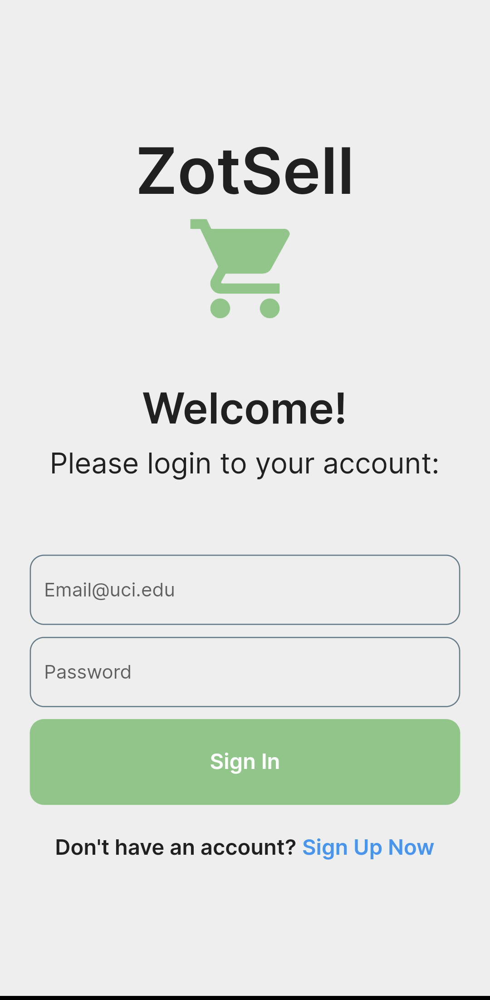

# What is it?
**ZotSellApp** is a mobile app based on [ZotSell](https://devpost.com/software/zot-n-sell) a Hackathon project with the vision to be a community marketplace platform where verified students are able to list and sell items to each other on campus. As students, we are always looking ways to save money, whether that be selling or buying used goods. And what better place for transactions to happen than on campus: a safe, public space where students gather throughout the week.  The app purely serves as a platform to connect students and to facilitate safe transactions in high traffic/well-known areas on campus. 

The mobile version **ZotSellApp** builds on top of the web app by introducing more streamlined UI, a 2FA login system, and the ability to list and view products in more detail. Currently the app is still being developed, and I have only been able to work on it in my free time. I plan to add more features to eventually have a version that can be published

# How was it Built?
The app was built for Android by using **Flutter**, an app development framework that is able to create apps for cross-platform use. I used the **Dart** language to create the UI and to write code for functionality. Flutter was chosen because I wanted to be able to release the app for iOS as well. Since the app is only being developed by me I wanted to be able to easily create a cross-platform app. I also enjoyed the structure of Dart, it is an OOP language that allows me to work on front-end and back-end code in the same space. I do not need to rely on another language or set of rules to layout a UI and to handle the functions to make it functional.

The backend is hosted on Firebase; Cloud Firestore and Cloud Storage were used to store listing data and images respectively. Firebase was chosen for its ease of integration with Flutter, both being Google products.

**Cloud Firestore** is a noSQL database that uses a system of collection and documents to store and relate data. In my case had all of the items listing in a collection, with each document representing a listing. 
- The **Authentication** service was used to handle user creation and to validate their emails. 2FA emails are sent out to user's UCI email to confirm their affiliation. Their user IDs are linked to each listing to link ownership.

**Cloud Storage** was used to store images for each listing. Each image was associated with its listing by attaching its listing ID as the filename.

# Images:

  
   
  
  

